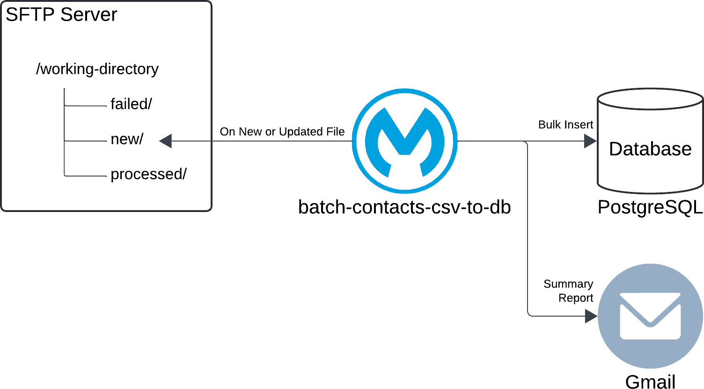
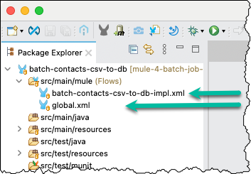
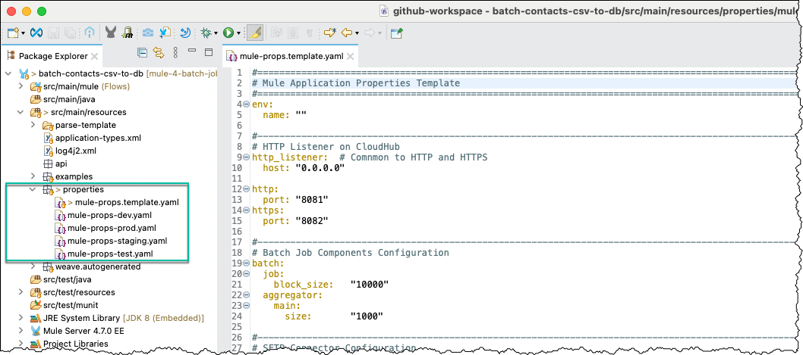
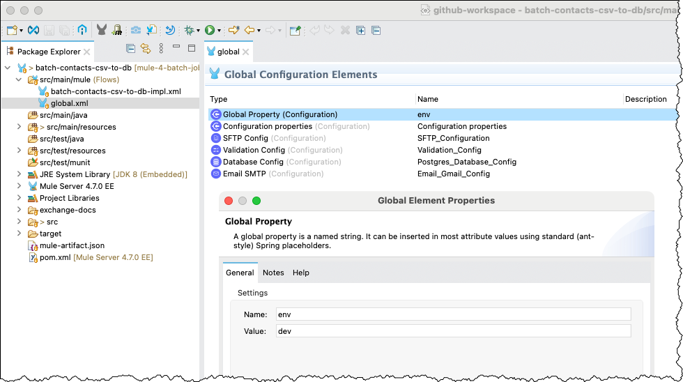
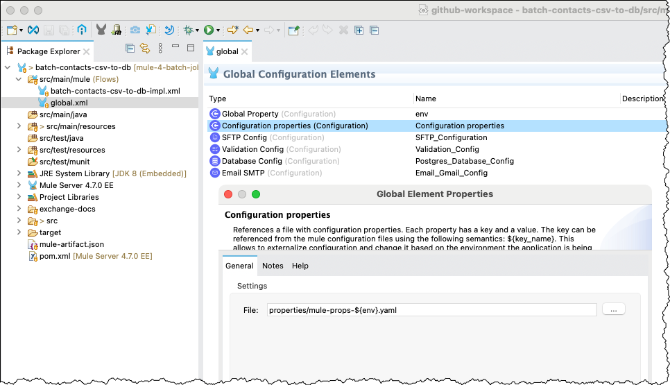
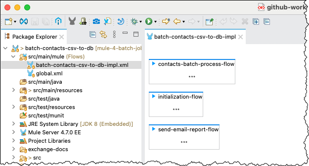
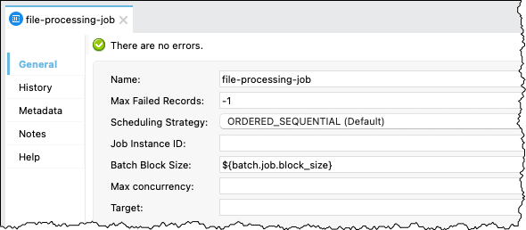
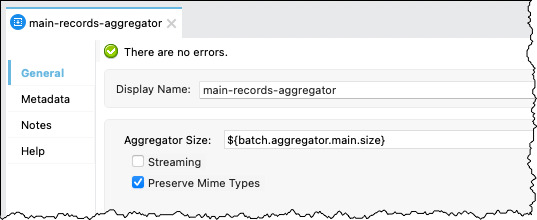
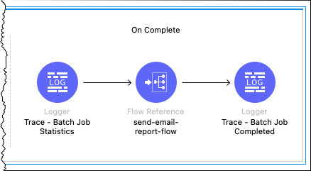
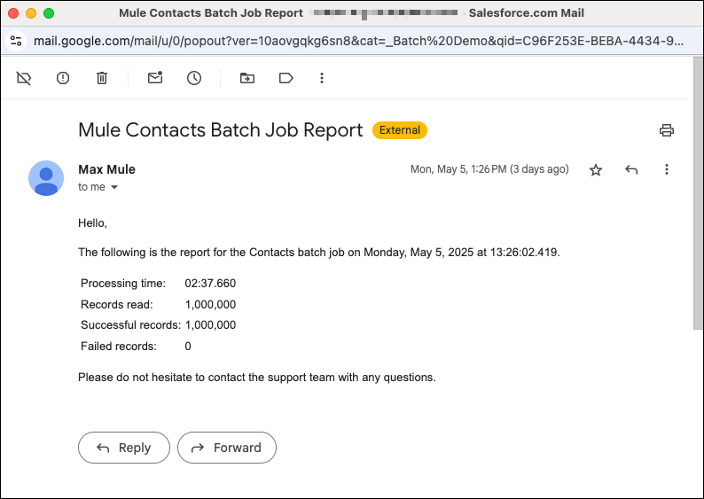

# Mule Project `batch-contacts-csv-to-db` Overview

The Mule project `batch-contacts-csv-to-db` originated in October 2022 as a proof of concept for processing millions of records using Mule 4. The initial requirements included reading contact data from a CSV file and inserting the data into a database. The project has since evolved into a comprehensive example demonstrating how to implement a batch job in Mule 4. Rather than addressing a specific business use case, the implementation is intended to illustrate Mule batch processing capabilities.

As the diagram illustrates, the Mule application monitors the `new` subdirectory on an SFTP server for new or updated files. The application expects CSV files containing contact data. When a new or updated file is detected, the application reads the contact data and bulk inserts the records into a PostgreSQL database using a Batch Job component. Upon completion of the Batch Job, the application sends a summary report via Gmail.

## Implementation Overview

> [!NOTE]
> This section assumes familiarity with Anypoint Studio and Mule flows, as well as an imported copy of the Mule project. Consequently, the discussion focuses on the implementation rather than providing detailed instructions or XML snippets.

The Contacts CSV File to Database example is implemented as an integration and does not expose a REST endpoint. The implementation uses two Mule configuration (XML) files to separate global configuration from application logic.

- The file `global.xml` contains the global elements, centralizing configuration shared across Mule configuration files.
- The file `batch-contacts-csv-to-db-impl.xml` contains the application implementation.

The project uses YAML properties files with the naming convention `mule-props-<environment>` to support environment-specific configuration, such as `mule-props-dev.yaml`, `mule-props-test.yaml`, and `mule-props-staging.yaml`.

> [!IMPORTANT]
> In accordance with information security best practices, the repository does not include environment-specific properties files because they contain credentials. The provided template can be used to create properties files appropriate for the target environment and resources.

### Mule Configuration File `global.xml`

The `global.xml` file contains a `Global Property` element named `env`, which specifies the current environment, such as `dev` in the screen capture.

> [!TIP]
> This approach allows the property to be overridden when deploying the application to other environments, such as test, staging, or production, resulting in the corresponding environment-specific properties file being loaded.

The `Configuration properties` element references a file that follows the `mule-props-<environment>` naming convention, enabling environment-specific configuration.

### Mule Configuration File `batch-contacts-csv-to-db-impl.xml`

The Mule configuration file `batch-contacts-csv-to-db-impl.xml` contains the implementation of the Contacts CSV File to Database example.

As the screen capture illustrates, the implementation contains three Mule flows:

- `contacts-batch-process-flow` is the main flow.
- `initialization-flow` and `send-email-report-flow` are child flows used to separate supporting logic from the main flow.

#### Child Flow `initialization-flow`

The child flow `initialization-flow` handles initialization tasks, primarily setting variables used during processing.

- The variable `startTime` captures the overall process start time for calculating the total processing duration.
- The variable `currentFilename` captures the source filename from the message attributes before those attributes are overridden by another processor.
- The variable `timestamp` captures the current timestamp for use in filenames, providing consistency and traceability.
- The variable `newFilename` contains the filename used when moving and renaming the processed file. It combines `currentFilename` and `timestamp` to indicate when the file was processed, for example, `Contact_Data_1m.20250506T224149099.csv`.
- The variable `errorsFilename` contains the filename used to record errors that occur during the Batch Job, for example, `Contact_Data_1m.20250506T224149099.errors.json`.

#### Child Flow `send-email-report-flow`

The child flow `send-email-report-flow` sends a summary report via Gmail upon completion of the Batch Job.

As the screen capture illustrates, a [`Parse Template` processor](https://docs.mulesoft.com/mule-runtime/latest/parse-template-reference) generates the email body. The template is located in [`src/main/resources/parse-template`](../src/main/resources/parse-template/contacts-batch-report-email.template). The implementation uses Gmail to send the summary report, although the email configuration can be adapted to use another supported email service or server.

#### Main Flow `contacts-batch-process-flow`

The following screen capture provides a high-level overview of the main flow `contacts-batch-process-flow`.

The `On New or Updated File` processor monitors the `new` subdirectory for new or updated files. If an error occurs outside the Batch Job during processing, the error handler moves the file to the `failed` subdirectory.

> [!NOTE]
> As described in the [Batch Processing documentation](https://docs.mulesoft.com/mule-runtime/latest/batch-processing-concept#error-handling), the Batch Job component handles record-level failures to prevent a single record failure from causing the entire batch job to fail. Consequently, the flow-level error handler handles errors that occur outside the Batch Job component, either before or after batch processing.

According to the [Batch Processing documentation](https://docs.mulesoft.com/mule-runtime/latest/batch-processing-concept#valid_input), the Batch Job component accepts Java `Iterable`, `Iterator`, and `Array` values, as well as JSON and XML payloads. Because CSV is not a valid Batch Job input, the `Transform Message CSV to Java` processor converts the CSV data before it enters the Batch Job.

> [!TIP]
> Mule runtime logging is intentionally limited by default. This implementation uses TRACE-level loggers extensively to provide visibility into flow and batch processing. These loggers are also useful during unit testing and debugging.

The following screen capture provides an overview of the Batch Job `file-processing-job`.

The Batch Job contains two Batch Step components:

1. The Batch Step `main-processing-step` implements the load portion of the process by bulk inserting contact records into the database.
2. The Batch Step `failed-records-processing-step` handles records that were not processed successfully by the preceding step, such as records that fail validation or encounter an error during database insertion.

The following screen capture shows the configuration of the Batch Job `file-processing-job`.

- The `Max Failed Records` setting is configured as `-1`, indicating no limit, and the `Batch Block Size` setting is configured through a property. All other settings use their default values.

The following screen capture shows the configuration of the Batch Step `main-processing-step`.

- The `Accept Policy` setting uses the default value `NO_FAILURES`, which prevents records that previously failed from entering this step.

The following screen capture shows the processors included in the Batch Step `main-processing-step`.

- The `Processors` section intentionally contains only the `Validation Is email` operation to keep the example focused. Additional processors can be included as required. Processors within a Batch Step are applied to each record individually and can therefore affect overall processing time.

The following screen capture shows the configuration of the Batch Aggregator `main-records-aggregator`.

- The `Aggregator Size` setting is configured through a property, and `Preserve Mime Types` is enabled. The Batch Aggregator collects records according to the configured `Aggregator Size` and passes the resulting array to its processors. For example, with an aggregator size of 1,000, the `Transform Message CSV to SQL` and `Bulk Insert Contact Data` processors operate on 1,000 records at a time.

> [!NOTE]
> The CSV file and database table intentionally use the same data model. Consequently, the `Transform Message CSV to SQL` processor performs a straightforward DataWeave mapping without substantive data transformation.

The following screen capture shows the configuration of the Batch Step `failed-records-processing-step`.

- The `Accept Policy` setting uses the value `ONLY_FAILURES`, allowing the step to process only records that failed during preceding batch processing.

The following screen capture shows the processors included in the Batch Step `failed-records-processing-step`.

The failure-handling implementation is intentionally simple while demonstrating one approach to processing failed records:

- The `Transform Message Create Error Record` processor handles each failed record individually and creates a JSON object containing the error information and associated record to support troubleshooting.
- The Batch Aggregator `failed-records-aggregator` collects the error objects and writes them to a dedicated error file in the SFTP server's `processed` subdirectory alongside the processed source file. Alternative implementations could route the error information to another destination, such as an email attachment.

The following screen capture shows the `On Complete` section of the Batch Job component.

The `On Complete` implementation performs two primary tasks:

- Logs the batch job report object, which provides statistics and additional information about the batch job execution.
- Sends a summary report via Gmail.

The following screen capture shows an example summary report.

---

Copyright © 2026 Alan Belisle. Licensed under the [Apache License 2.0](/LICENSE).
