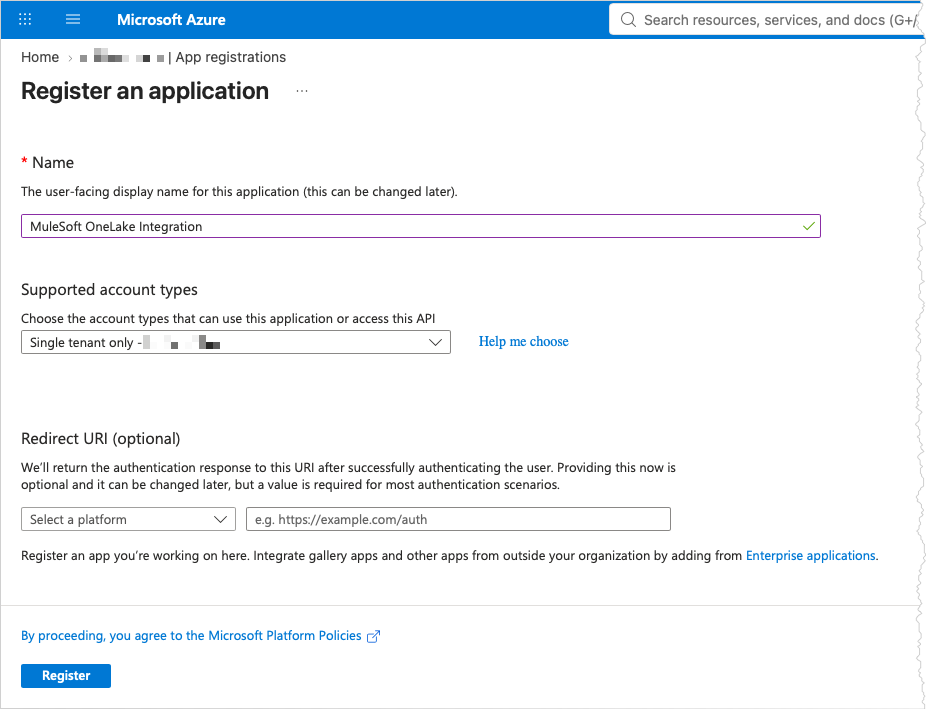
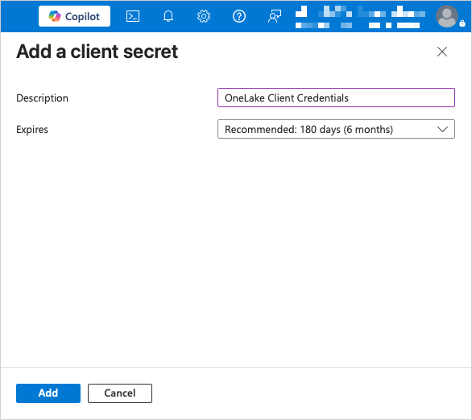
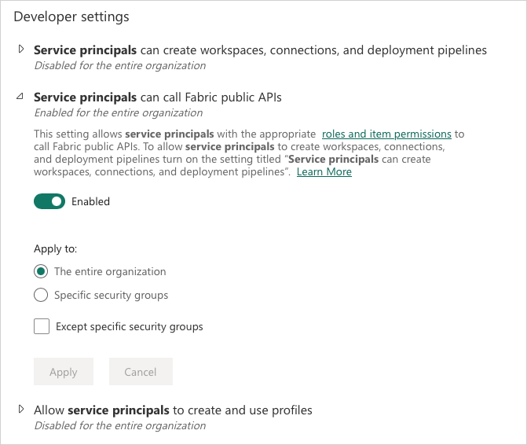
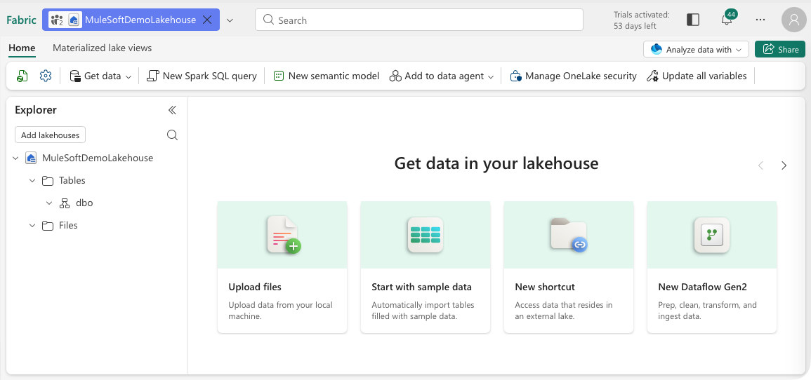
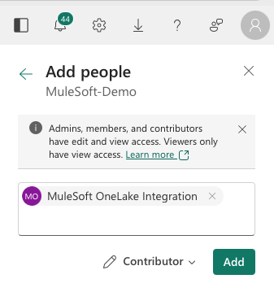

# Configure Microsoft Fabric

This guide describes how to configure Microsoft Entra ID and Microsoft Fabric for use with the Mule project `batch-contacts-csv-to-onelake`.

## Prerequisites

This guide assumes access to a Microsoft Entra ID tenant and Microsoft Fabric. The Entra ID tenant provides the identity used by MuleSoft to authenticate with Microsoft Fabric.

### Microsoft Entra ID Tenant

A Microsoft Entra ID tenant is required. The tenant must provide an organizational account that can be used to configure both Entra ID and Microsoft Fabric. A custom internet domain is not required. Microsoft Entra ID provides a default domain when the tenant is created:

```text
<tenant-name>.onmicrosoft.com
```

The account used for this setup must have sufficient permissions to:

- Register applications in Microsoft Entra ID.
- Create credentials for an application.
- Manage the resulting service principal.

### Microsoft Fabric

The Microsoft Entra ID application used by MuleSoft and the Microsoft Fabric environment must belong to the same Microsoft Entra ID tenant.

The account used for this setup must have sufficient Microsoft Fabric permissions to:

- Configure the required Fabric tenant settings.
- Create a workspace.
- Create a Lakehouse.
- Manage workspace access.


## Procedure

### 1. Verify the Entra ID and Fabric Tenant

Before continuing, verify that Microsoft Entra ID and Microsoft Fabric use the same tenant.

1. In the Microsoft Entra admin center, open **Entra ID → Overview** and record the **Directory (tenant) ID**.
2. In Microsoft Fabric, verify the tenant associated with the current Fabric environment.
3. Confirm that the tenant IDs match.

The Entra application created in the following steps must belong to the same tenant as the Fabric workspace.

### 2. Register the MuleSoft Application in Entra ID

1. Sign in to the **Microsoft Entra admin center**.
2. Navigate to: **Entra ID → App registrations**
3. Select **New registration**.
4. Enter a descriptive application name, for example:

    ```text
    MuleSoft OneLake Integration
    ```

5. Select:

    ```text
    Single tenant only
    ```

6. A redirect URI is not required for Client Credentials authentication.

    

7. Select **Register**.

After registration, record the following information:

```text
Application (client) ID
Directory (tenant) ID
```

These values are required by the Mule application.

### 3. Create the Client Secret

From the application registration:

1. Navigate to: **Certificates & secrets → Client secrets**
2. Select **New client secret**.
3. Enter a description and select an appropriate expiration period.

    

4. Verify the configuration and select **Add**.
5. Immediately copy the generated **secret Value**.

> [!WARNING]
> The secret value is displayed only once. Store it securely and do not commit it to Git. The secret value is the third and last required value for the Mule application.

### 4. Understand API Permissions

No additional delegated Microsoft Graph permissions need to be configured for the OneLake file operations used by this project.

Access to OneLake is granted to the service principal through the Microsoft Fabric workspace, rather than by granting the application broad access to the Azure subscription.

The OAuth token request uses the Azure Storage scope:

```text
https://storage.azure.com/.default
```

The OAuth token endpoint is:

```text
https://login.microsoftonline.com/<tenant-id>/oauth2/v2.0/token
```

### 5. Enable Service Principal Access in Fabric

Microsoft Fabric must permit service principals to use its APIs.

1. Sign in to Microsoft Fabric as a Fabric administrator.
2. Open: **Settings → Admin portal → Tenant settings**.
3. In **Filter by keyword**, enter `service principals`.
4. Locate **Service principals can call Fabric public APIs** under **Developer settings**.
5. Enable the setting for the entire organization, or for the appropriate security group if access is being restricted.

     

### 6. Create the Fabric Workspace

Create a Microsoft Fabric workspace for the integration.

1. In Microsoft Fabric, select **Workspaces** from the left navigation menu.
2. Select **New workspace**.
3. Enter a descriptive workspace name, for example:

    ```text
    MuleSoft-Demo
    ```

4. Configure the workspace with an appropriate Fabric capacity and other settings for the target environment.
5. Select **Apply** to create the workspace.

For OneLake access, the workspace name represents the ADLS Gen2 filesystem portion of the OneLake path:

```text
https://onelake.dfs.fabric.microsoft.com/<workspace-name>/...
```

The workspace name is therefore used later as the File System value when configuring the Azure Data Lake Storage Connector.

### 7. Create the Lakehouse

1. Select **New item**.
2. Under **Store data**, select **Lakehouse**.
3. Enter a descriptive Lakehouse name, for example:

    ```text
    MuleSoftDemoLakehouse
    ```

4. Leave the remaining settings at their default values and select **Create**.

    

Files uploaded through the integration are stored in the **Files** area of the Lakehouse. The resulting OneLake path has the following form:

```text
<lakehouse-name>.Lakehouse/Files/<filename>
```

For example:

```text
MuleSoftDemoLakehouse.Lakehouse/Files/contact-data-100.csv
```

### 8. Grant the Service Principal Workspace Access

The service principal must be authorized to write to the Fabric workspace.

1. In Microsoft Fabric, select **Workspaces** from the left navigation menu, and select the workspace created earlier.
2. Select **Manage access**.
3. Select **Add people or groups**.
4. Search for and select the Entra ID application/service principal created earlier:

    ```text
    MuleSoft OneLake Integration
    ```

5. Assign the **Contributor** role.

    

6. Select **Add**.

No Azure Storage Account or separate ADLS Gen2 account is required. Mule writes directly to OneLake.

After completing the Microsoft Entra ID and Microsoft Fabric configuration, return to the [Getting Started](getting-started.md) guide to configure and run the Mule application.

## Configuration Reference

| Configuration | Value / Source | Mule Configuration |
|---|---|---|
| Tenant ID | Microsoft Entra ID → Overview | `secure::azure.tenant_id` |
| Client ID | Microsoft Entra ID → App registrations → Application (client) ID | `secure::azure.client_id` |
| Client Secret | Microsoft Entra ID → App registrations → Certificates & secrets | `secure::azure.client_secret` |
| Workspace Name | Microsoft Fabric workspace name | `onelake.workspace` |
| Lakehouse Name | Microsoft Fabric Lakehouse name | `onelake.lakehouse` |
| OneLake Endpoint | `https://onelake.dfs.fabric.microsoft.com` | Azure Data Lake Storage Connector Base URI |
| OAuth 2.0 Token Endpoint | `https://login.microsoftonline.com/<tenant-id>/oauth2/v2.0/token` | Azure Data Lake Storage Connector Token URL |
| OAuth 2.0 Scope | `https://storage.azure.com/.default` | — |
| OneLake Base Path | `<lakehouse-name>.Lakehouse/Files/` | `onelake.base_path` |
