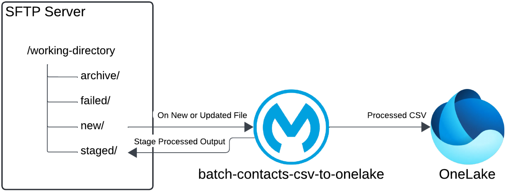
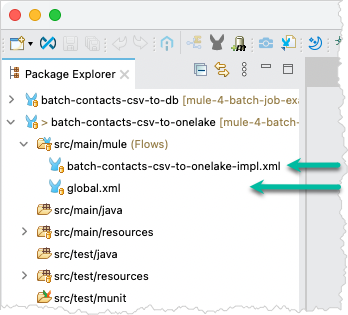
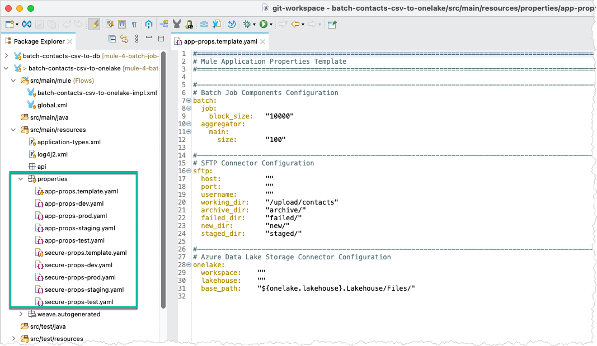
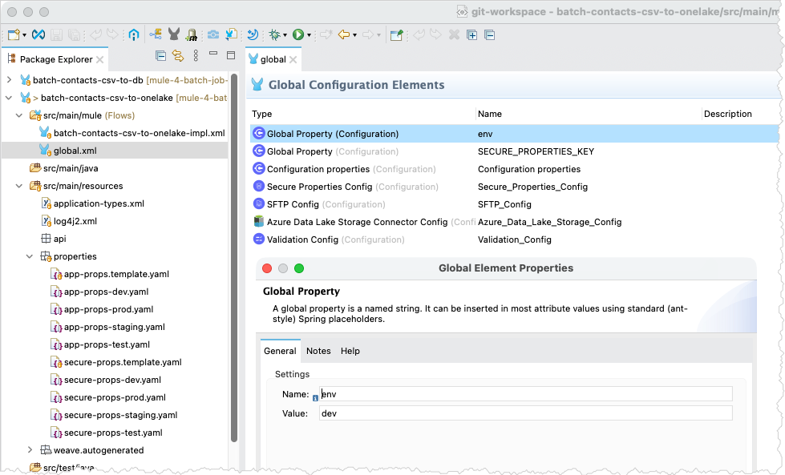
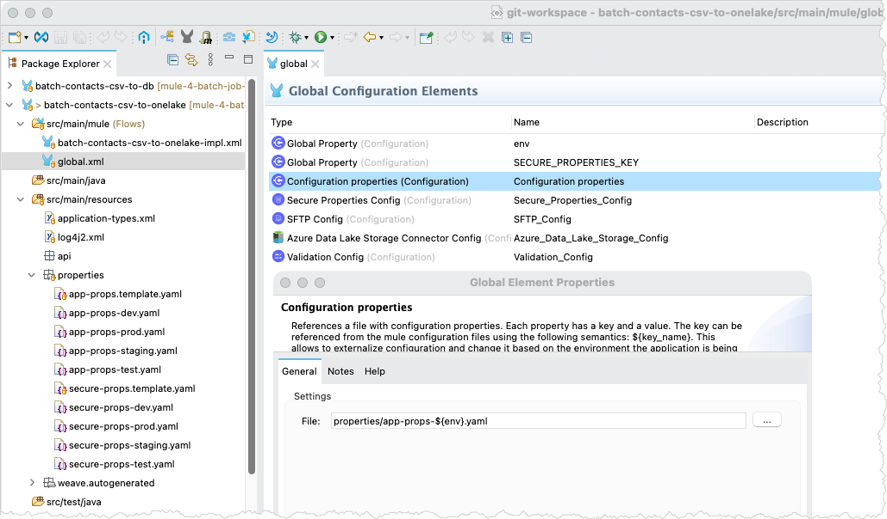
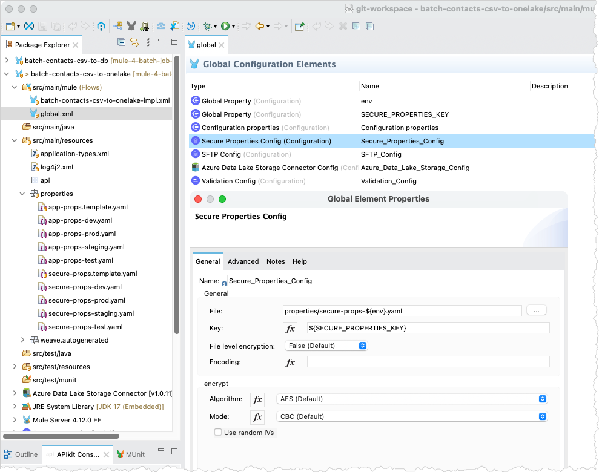
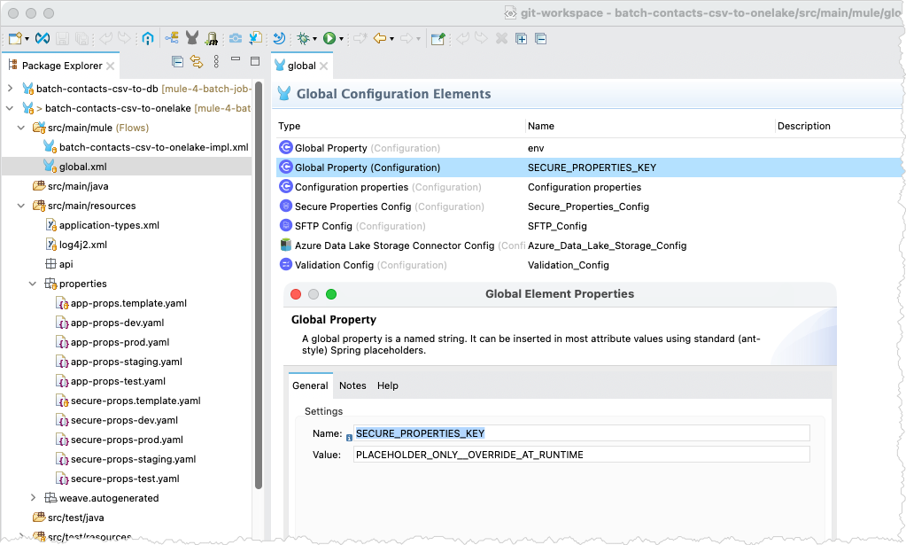
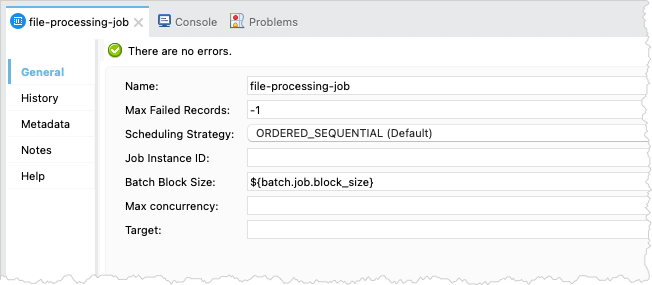

# Mule Project `batch-contacts-csv-to-onelake` Overview

The Mule project `batch-contacts-csv-to-onelake` provides an advanced example of batch processing and file integration in Mule 4. Building on the foundational concepts demonstrated by `batch-contacts-csv-to-db`, the implementation illustrates how Mule batch processing can be combined with file staging, record-level failure handling, and cloud-based file delivery. The application uses the SFTP Connector to monitor a directory for new or updated CSV files containing contact data, processes the records using a Batch Job component, stages the successfully processed output on the SFTP server, and delivers the resulting CSV file to Microsoft OneLake.



As the diagram illustrates, the Mule application monitors the `new` subdirectory on an SFTP server for new or updated CSV files containing contact data. When a file is detected, the application processes the records asynchronously using a Batch Job. Successfully processed records are written incrementally to a staged CSV file, while failed records are captured separately in an error file. Upon completion of the Batch Job, the application reads the completed staged file and delivers it to Microsoft OneLake using the Azure Data Lake Storage Connector. The source and staged files are archived at appropriate stages of the processing lifecycle, and structured lifecycle events provide operational visibility throughout the process.

## Design Considerations

This project demonstrates a more advanced batch processing and file integration implementation in Mule 4. Some implementation choices have been intentionally simplified to illustrate specific Mule batch processing and integration capabilities rather than represent a complete production implementation.

### Error Handling

The error-handling implementation is intentionally simple and addresses failures differently depending on where they occur in the processing lifecycle.

Failures that occur during the synchronous portion of the flow, before the data is staged for asynchronous batch processing, are handled by the flow's Error Handler scope. The current implementation provides basic handling of these failures rather than a comprehensive recovery strategy.

Once processing is handed off to the Batch Job, the Batch Job handles record-level failures. The Batch Job processes failed records separately and writes them to an error file. A production implementation would typically require additional error classification, recovery, observability, and operational considerations.

### Record Validation

The main Batch Step includes a simple email-address validation operation to demonstrate record-level validation and failure handling. Each input record must therefore contain an `email` field. The validation is included specifically to exercise the Batch Job's failed-record processing and does not represent a comprehensive data-validation strategy.

## Implementation Overview

> [!NOTE]
> This section assumes familiarity with Anypoint Studio and Mule flows, as well as an imported copy of the Mule project. Consequently, the discussion focuses on the implementation rather than providing detailed instructions or XML snippets.

The Mule application does not expose a REST endpoint. The implementation uses two Mule configuration (XML) files to separate global configuration from application logic.

- The file `global.xml` contains the global elements, centralizing configuration shared across Mule configuration files.
- The file `batch-contacts-csv-to-onelake-impl.xml` contains the application implementation.



The project uses YAML property files with the naming convention `<type>-props-<environment>` to support environment-specific configuration. The `app` type contains non-sensitive application properties, while the `secure` type contains encrypted application properties.



> [!IMPORTANT]
> Environment-specific properties files are not included in the repository. The provided templates can be used to create the application and secure properties files appropriate for the target environment and resources. Secure properties files may contain credentials or other sensitive configuration and should not be committed to the repository.

### Mule Configuration File `global.xml`

The `global.xml` file contains a `Global Property` element named `env`, which specifies the current environment, such as `dev` in the screen capture.



> [!TIP]
> This approach allows the property to be overridden when deploying the application to other environments, such as test, staging, or production, resulting in the corresponding environment-specific properties file being loaded.

The `Configuration properties` element references a file that follows the `app-props-<environment>` naming convention, enabling environment-specific configuration.



The `Secure Properties Config` element references a file that follows the `secure-props-<environment>` naming convention and uses the `SECURE_PROPERTIES_KEY` property as the decryption key.



Finally, the `global.xml` file contains another `Global Property` element named `SECURE_PROPERTIES_KEY`, which specifies the key to use for decrypting the secure properties.



> [!WARNING]
> The value of the `SECURE_PROPERTIES_KEY` must be provided at runtime and must not be stored in the repository.

### Mule Configuration File `batch-contacts-csv-to-onelake-impl.xml`

The Mule configuration file `batch-contacts-csv-to-onelake-impl.xml` contains the application implementation. The implementation consists of three Mule flows:

- `process-file-flow` is the main flow.
- `initialization-flow` and `deliver-file-to-onelake-flow` are child flows used to separate supporting logic from the main flow.

#### Child Flow `initialization-flow`

The child flow `initialization-flow` handles initialization tasks, primarily setting variables used during processing.


- The variable `startTime` captures the start of the end-to-end processing window and is used to calculate total elapsed time.
- The variable `sourceFilename` captures the filename received from the SFTP server before the message attributes are overwritten by another processor.
- The variable `sourceExtension` captures the file extension of the inbound source file.
- The variable `sourceFileSize` captures the size of the inbound source file for audit and operational visibility.
- The variable `baseFilename` contains the portion of `sourceFilename` before the final period and is used to derive the other filenames.
- The variable `archivedFilename` contains the filename used when the original source file is archived.
- The variable `errorsFilename` contains the filename used when failed Batch records are written to an error file.
- The variable `oneLakeFilename` contains the filename used for the processed file delivered to OneLake.
- The variable `stagedFilename` contains the filename used for the temporary processed file staged on the SFTP server before delivery to OneLake.

##### File Naming

The Mule correlation ID is embedded in generated filenames so that physical artifacts can be correlated with the corresponding application processing lifecycle. Structured log events generated during processing include the same correlation ID.

| Variable | Meaning | Example |
|---|---|---|
| `sourceFilename` | Original source filename | `contact-data-100.csv` |
| `archivedFilename` | Source filename used when the original file is archived | `contact-data-100.<correlationId>.source.csv` |
| `stagedFilename` | Temporary processed-output filename staged on SFTP | `contact-data-100.<correlationId>.staged.csv` |
| `oneLakeFilename` | Processed filename delivered to OneLake | `contact-data-100.<correlationId>.csv` |
| `errorsFilename` | Filename containing failed Batch records | `contact-data-100.<correlationId>.errors.json` |

#### Child Flow `deliver-file-to-onelake-flow`

The child flow `deliver-file-to-onelake-flow` uploads the processed results to OneLake. Ideally, the processed data emitted by the Batch Aggregator would be uploaded directly to OneLake in chunks, preserving the benefits of Batch processing throughout the file lifecycle. However, the OneLake Append operation requires both the size of each payload and its offset within the destination file. The Batch Job does not provide a practical mechanism for maintaining the required sequential offset as Batch Aggregators process records incrementally.

To address this constraint, the Batch Aggregator writes successfully processed records to a staged file on the SFTP server. Once the Batch Job completes, Mule reads the completed staged file, determines its size, and uploads it to OneLake using the required **Create → Append → Flush** sequence.


> [!IMPORTANT]
> The current implementation uploads the completed staged file using a single Append operation. A staged file that exceeds the maximum payload size supported by an individual Append operation would require the staged file to be read and uploaded in multiple chunks, with each Append operation specifying the corresponding offset.
>
> The payload limit applies to each Append operation rather than to the resulting OneLake file. Multiple chunks can therefore be appended sequentially to construct a larger file.

#### Flow `process-file-flow`

The flow `process-file-flow` is the primary flow and orchestrates the entire file lifecycle, from the SFTP server to OneLake. When a file is received, the flow initializes the processing context, including the original filename, file size, correlation-based artifact names, and processing start time. The file is then submitted to the Batch Job for asynchronous record-level processing.


The flow includes an `On Error Propagate` handler to address synchronous processing failures. Upon encountering an error, the handler emits both a `FILE_PROCESSING_FAILED` operational event and a `FILE_AUDIT` event with an outcome of `FAILED`. Subsequently, it moves the inbound source file to the SFTP failure directory. This approach ensures operational visibility and retains the failed source artifact for further investigation. The handler applies only to failures within the synchronous portion of `process-file-flow`; record-level failures during asynchronous Batch processing are handled separately by a dedicated Batch Step.

The Batch Job processes records asynchronously. In the initial Batch Step, each record is validated to confirm that the `email` field contains a valid email address. This validation is included for demonstration purposes to illustrate how record-level validation can be incorporated into Batch processing and how validation failures can be handled separately. Records that pass validation are collected by a Batch Aggregator and written incrementally to a staged file on the SFTP server. This staging approach addresses the OneLake API upload constraints described in the `deliver-file-to-onelake-flow` section. Records that fail validation or otherwise fail during Batch processing are handled by the subsequent Batch Step, which constructs JSON objects containing both the failed record and the associated error message. These objects are aggregated and written to an error file. This approach demonstrates record-level validation and failure handling while keeping the implementation straightforward.


Upon completion of the Batch Job, the staged file contains the successfully processed output and becomes eligible for delivery to OneLake. During the `On Complete` phase, the application reads the file, records its size, invokes `deliver-file-to-onelake-flow`, and archives the staged file after successful delivery. Batch completion, delivery to OneLake, and archival are each recorded as distinct lifecycle milestones.


> [!NOTE]
> The implementation employs the SFTP server both as the inbound file source and as a durable staging and archival storage solution.
>
> Processing of the inbound source file, asynchronous Batch processing, OneLake delivery, and archival are managed as distinct stages of the file lifecycle. Each lifecycle milestone is logged independently, and the corresponding file artifacts are retained as required.

##### Batch Job Configuration

The Batch Job `file-processing-job` is configured with `Max Failed Records` set to `-1`, allowing processing to continue regardless of the number of failed records. The Batch Block Size is configured through the `batch.job.block_size` application property, while the remaining Batch Job settings use their default values.



The Batch Step `main-processing-step` uses the default `NO_FAILURES` accept policy, preventing records that previously failed, such as during CSV parsing, from entering the step.


The Batch Aggregators `main-records-aggregator` and `failed-records-aggregator` have **Streaming** and **Preserve Mime Types** enabled. With streaming enabled, the aggregators process records as they become available rather than collecting records according to a configured Aggregator Size. Successfully processed records are written incrementally to the staged file, while failed-record error objects are written incrementally to the error file.


The Batch Step `failed-records-processing-step` uses the `ONLY_FAILURES` accept policy, allowing it to process only records that failed during preceding Batch processing, including records rejected by the email-address validation.


##### Creating Error Records

In the Batch Step `failed-records-processing-step`, the `Transform Message Create Error Record` processor creates a JSON object containing the failed record and its associated error message.


```dataweave
%dw 2.0
output application/json
---
{
    error: Batch::getFirstException().message,
    record: payload[0]
}
```

The `Batch::getFirstException()` function retrieves the first exception associated with the current failed Batch record. The `message` property captures the corresponding error message, while `payload[0]` retrieves the original record from the Batch payload. The resulting JSON object is subsequently collected by the `failed-records-aggregator` and written to the error file on the SFTP server.


---

Copyright © 2026 Alan Belisle. Licensed under the [Apache License 2.0](/LICENSE).
